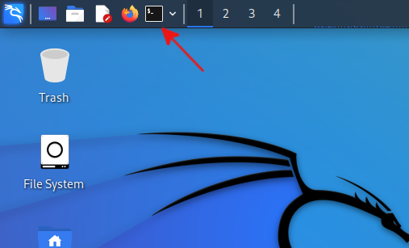

# Hexdump

Every file, of any kind, stored on a computer is composed of bytes. *We* interpret those bytes as something -- values of red, green and blue for pixels of an image, encodings of characters in strings for a Word document, operations that a processor can execute for a program, etc -- but they are really just ... bytes. It is often the case that malware analysts don't know the interpretation to apply to the bytes in a suspicious file and just want to see their values.

`hexdump` will let you do just that.

In this Say As I Do, we will use `hexdump` to look at the bytes of a PDF, a PNG and a program (compiled to run on the Linux operating system).

## Terminal

`hexdump` is a command-line utility, so the first thing that you will need to do is to open an instance of the *Terminal Emulator*. If you are using Kali Linux, you can click on the icon in the upper-left of the Desktop (see the red arrow in the figure below.).



### Interstitial: Move demo files

Before going further, make sure that you have moved the demo files ([example.pdf](../files/example.pdf), [example.png](../files/example.png) and [example.bin](../files/example.bin)) to a place where you can access them from the computer (note: this "computer" may be a virtual machine) running the *Terminal Emulator*. 

## Get Situated

When executing from the shell (a.k.a., the command line), there is a concept known as the current working directory. Any file that you access with a [relative path](https://en.wikipedia.org/wiki/Path_(computing)#Absolute_and_relative_paths) happens with respect to this directory. People using the command line say that they are "in" a certain directory when that is their current working directory.

Let's make sure that our current working directory is the directory that contains the three example files. If you stored the sample files in a directory named `/home/kali/Desktop/files`, then you could use `cd` to *c*hange *d*irectory into that current working directory:

```console
$ cd /home/kali/Desktop/files
```

To verify that I am in the right spot, I can ask the shell to tell me the current working directory by using the `pwd` command:

```console
$ pwd
/home/kali/Desktop/files
```

Finally, to double check, I will ask the shell to *l*i*s*t the contents of the current working directory:

```console
$ ls
example.bin  example.pdf  example.png
```

Fantastic!

## `hexdump`ster Fire

Now we can use `hexdump`. First, let's drink from the firehose and ask `hexdump` to print out *all* the bytes in one of the example files. We will ask `hexdump` to use a specific format -- we will use the `-C` *command-line switch* to do that:

```console
$ hexdump -C example.png
```

Woah, that's a ton of information.

Let's look at just one line (randomly chosen) and decipher what is being printed:

```
000027c0  05 6d 0b 4a 00 00 00 00  49 45 4e 44 ae 42 60 82  |.m.J....IEND.B`.|
```

Okay, 
1. Everything to the left of the first space is the address of the first byte displayed on that line (see (2)), printed in hexadecimal format;
2. Everything between the first space and the `|` are the hexadecimal values of the 16 bytes starting at the address listed in (1); and
3. Everything to the right of the `|` are the (if printable) ASCII-converted values of those bytes.

In this example, then, `0x05` is the value of the byte at address `0x27c0` in the file; `0x60` is the value of the byte at address `0x27ce` which is a `D` in ASCII. 

## Rain (sic) It In

Let's say that we don't want *all* that information. Instead, we want a subset. In particular, we want just the first, say, 64 bytes of the file. There are a few ways to do this. The *easy* way that generally works for limiting the output of *any* command issued in the shell is to use a [*pager*](https://en.wikipedia.org/wiki/Terminal_pager) like `less`, or `more` (just remember that [less is more](https://askubuntu.com/a/1192084)).

However, we want to do things the hard way. Fortunately, `hexdump` will oblige. We can give another command-line option to `hexdump` to instruct it how many bytes to list. That command-line switch is `-n` and we give the number of bytes requested after that.

```console
$ hexdump -C -n 64 example.png
00000000  89 50 4e 47 0d 0a 1a 0a  00 00 00 0d 49 48 44 52  |.PNG........IHDR|
00000010  00 00 01 33 00 00 01 df  08 06 00 00 00 3c de 3f  |...3.........<.?|
00000020  a7 00 00 00 04 67 41 4d  41 00 00 b1 8f 0b fc 61  |.....gAMA......a|
00000030  05 00 00 00 20 63 48 52  4d 00 00 7a 26 00 00 80  |.... cHRM..z&...|
```

# Say As I Do

1. Dump the first 32 bytes of the `example.bin` file.
2. Dump the first 128 bytes of the `example.pdf` file.
3. What is the 87th byte (that's decimal 87!) of the `example.png` file?

[Answer](./hexdump-ans.md)